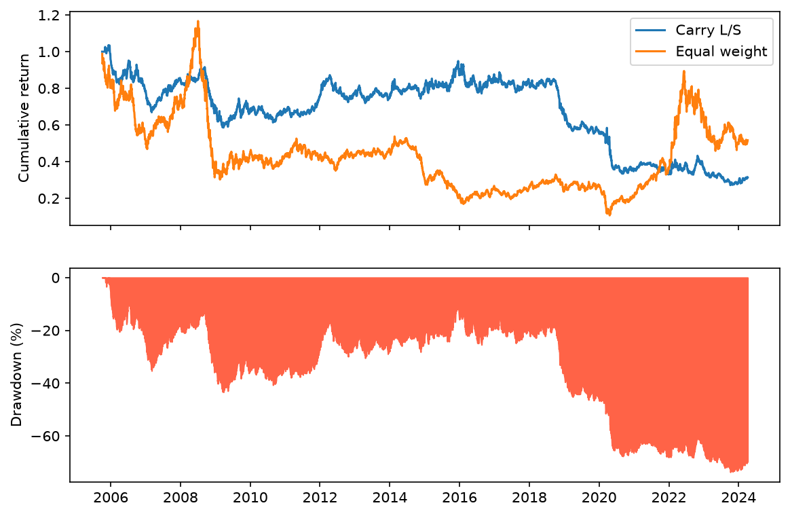
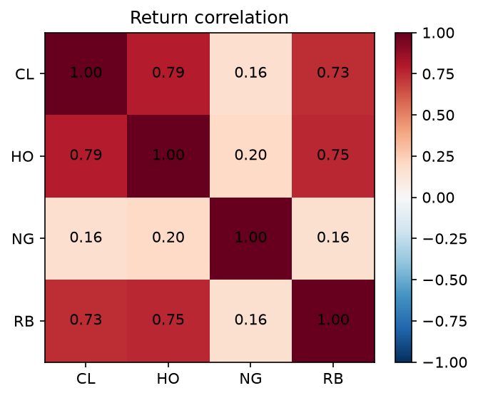
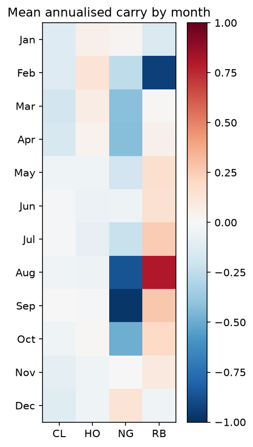

# Commodity Futures Carry & Term Structure

A cross-sectional carry strategy on four NYMEX energy futures, backtested from October 2005 to April 2024. The strategy returns a Sharpe ratio of **−0.29**. This repository documents why, and the answer is the structure of the universe rather than the implementation: three of the four contracts are effectively the same asset, so the cross-section collapses into a seasonal natural-gas-versus-oil position.

---

## Data

Daily settlement prices for contracts 1 and 2 from the EIA's NYMEX futures series.

| EIA code | Contract | Description | Units |
|---|---|---|---|
| EPC0 | CL | WTI crude oil | $/bbl |
| EPD2F | HO | Heating oil (No. 2 fuel oil) | $/gal |
| EPG0 | NG | Henry Hub natural gas | $/MMBtu |
| EPMRR | RB | RBOB gasoline | $/gal |

Sample: 2005-10-03 to 2024-04-05, 4,667 daily observations for both the front and back frames. The start date is when RBOB gasoline first appears in both series; the end date is when the EIA discontinued publication.

Source: [EIA NYMEX Futures Prices](https://www.eia.gov/dnav/pet/PET_PRI_FUT_S1_M.htm). The page title now reads "Futures prices after April 5, 2024, are not available." The sample is therefore frozen and reproducible.

**Why energy only.** Carry requires two contract months for the same commodity. The EIA publishes the curve for energy products; no free source provides a reliable deferred contract for metals or agriculturals. Front-month continuous series such as Yahoo's `GC=F` cannot produce a front-back spread, so gold, copper and corn are outside what this data supports.

---

## Method

### Expiry calendar

CME termination rules encoded per contract, using a US federal holiday calendar rather than plain business days.

- **CL** — three business days before the 25th calendar day of the month preceding delivery; four if the 25th is not a business day.
- **NG** — three business days before the first calendar day of the delivery month.
- **HO, RB** — last business day of the month preceding delivery.

The holiday adjustment is not cosmetic. The January 2019 WTI contract terminated on **2018-12-19**, not the 20th, because 25 December 2018 was a holiday and the conditional clause applies. A naïve business-day offset is wrong for that contract and for every expiry falling near Thanksgiving, Independence Day or Christmas.

The calendar is generated two months either side of the sample so that the first month has a preceding expiry and the last has a forward horizon.

### Carry signal

Annualised roll yield:

```
carry = (F1 / F2 − 1) × 365 / days_to_next_expiry
```

Positive values indicate backwardation (front above back) and are long candidates. The annualisation horizon comes from the expiry calendar rather than a fixed 30 days, so the signal generalises to contracts with non-monthly cycles.

Final observation, 2024-04-05: CL +0.10, HO +0.04, NG −1.36, RB +0.09. The gas figure is not an error — front-month gas traded at $1.785 against $2.010 for the second month, an 11% one-month spread reflecting the storage economics of natural gas.

### Roll-adjusted returns

The EIA's "contract 1" series is stitched: on the session after expiry it refers to a different contract. Differencing it directly books the roll gap as a return, which is precisely the quantity a carry strategy is attempting to harvest, and inflates results on a strategy designed to trade contango.

The correction uses the expiry calendar to identify the first trading session after each expiry and takes the previous price from contract 2 on those days:

```
prev = F2.shift() where a roll occurred, else F1.shift()
ret  = F1 / prev − 1
```

Mean absolute daily return across the four contracts: 0.018829.

### Data handling

Front and back frames are aligned on a union index, so a date missing from one series is retained as a null rather than silently deleted — dropping a date would fabricate a two-day return in the series.

Non-positive prices are masked. WTI settled at **−$37.63 on 2020-04-20**, against $20.43 for the second month. A ratio-based signal cannot survive a negative denominator: the raw carry that day is −2.84, roughly 25 times the magnitude of the most extreme gas reading, and it pins crude to the bottom rank on the strength of a single print. Removing one cell out of 18,668 moves the strategy Sharpe from +0.05 to −0.29.

---

## Portfolio construction

- Signal downsampled to month-end and ranked cross-sectionally across the four contracts
- Long the top two at +0.25, short the bottom two at −0.25
- Gross exposure 1.0, net exposure 0.0
- Weights lagged one session: the signal is observed at the month-end close and traded the following day
- Transaction costs of 5bps per unit traded, applied to turnover
- Realised turnover approximately 6.6× per year

---

## Results

|  | Carry L/S | Equal-weight long |
|---|---|---|
| Sharpe | −0.29 | 0.05 |
| Annualised return | −6.1% | −3.5% |
| Annualised volatility | 16.6% | 32.1% |
| Maximum drawdown | −73.7% | −90.8% |

The strategy loses more per year than simply holding all four contracts. It halves volatility and reduces maximum drawdown by 17 percentage points, which is the expected behaviour of a market-neutral book, but it does not outperform on return.



The failure is concentrated rather than uniform. Carry ran ahead of the benchmark from 2009 to 2018, holding around 0.8 while equal-weight sat near 0.4, then surrendered the entire advantage in a single drawdown beginning in late 2018 and never recovered.

---

## Why carry fails on this universe

### The cross-section is not a cross-section



|  | CL | HO | NG | RB |
|---|---|---|---|---|
| **CL** | 1.00 | 0.79 | 0.16 | 0.73 |
| **HO** | 0.79 | 1.00 | 0.20 | 0.75 |
| **NG** | 0.16 | 0.20 | 1.00 | 0.16 |
| **RB** | 0.73 | 0.75 | 0.16 | 1.00 |

Crude, heating oil and gasoline correlate at 0.73 to 0.79. Natural gas correlates with all three at roughly 0.16. Ranking four contracts where three move together does not produce a diversified long/short book; it produces a gas-versus-oil bet with additional steps.

### The signal is close to static

Share of months in which each contract is a short leg:

| CL | HO | NG | RB |
|---|---|---|---|
| 55.2% | 42.2% | **76.2%** | 26.0% |

Natural gas occupies a short position in three months out of four across eighteen years. A signal that reaches the same conclusion 76% of the time is not responding to changing curve conditions.

### What it is actually trading



Mean annualised carry by calendar month reveals the mechanism. Gas carry falls to −0.86 in August and −0.98 in September, reflecting the injection season. Gasoline swings from −0.93 in February to +0.80 in August on the driving-season cycle. Crude and heating oil are close to flat all year.

The strategy is therefore short gas and long gasoline every late summer, and it is doing so because of the calendar rather than because of a risk premium. Carry here has degenerated into a seasonal position.

### The comparison that frames it

Macrosynergy report a Pearson correlation of roughly 4% between carry and subsequent monthly returns across 23 commodity markets, positive in around 70% of years. Their result depends on carry being weakly correlated *across* commodities, which is what makes a carry book diversified. Four contracts drawn from a single complex have no such breadth, and the premium does not survive without it.

---

## Limitations

- The US federal holiday calendar approximates the CME calendar; the two differ on Good Friday and a small number of other dates
- Transaction costs are a flat 5bps rather than modelled from bid-ask spreads or market impact
- No volatility scaling, so natural gas dominates the risk contribution despite equal notional weights
- Four contracts is a thin cross-section for any ranking strategy

## Possible extensions

- Normalise carry by its rolling mean absolute value and winsorise, so gas does not mechanically occupy the bottom rank
- Seasonally adjust the signal on a point-in-time basis to test whether any premium remains once the calendar effect is removed
- Scale positions to a volatility target
- Regress carry returns on real yields (FRED `DFII10`) and the dollar index (`DTWEXBGS`) to identify macro drivers
- Extend the universe beyond energy if curve data becomes available

---

## Repository

```
CommodityCarry.py    signal, returns, backtest, charts
fetch_data.py        EIA API client and paginated fetch
eia_raw.csv          cached raw data (source discontinued)
```

Requires an EIA API key in the `EIA_API_KEY` environment variable to re-fetch. The cached CSV is sufficient to reproduce every number above.
